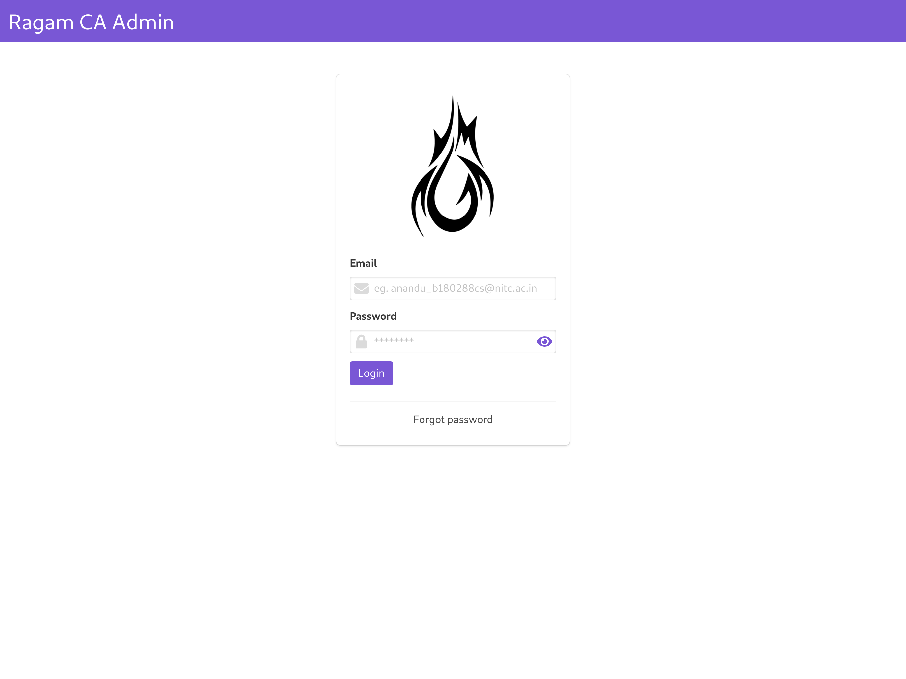
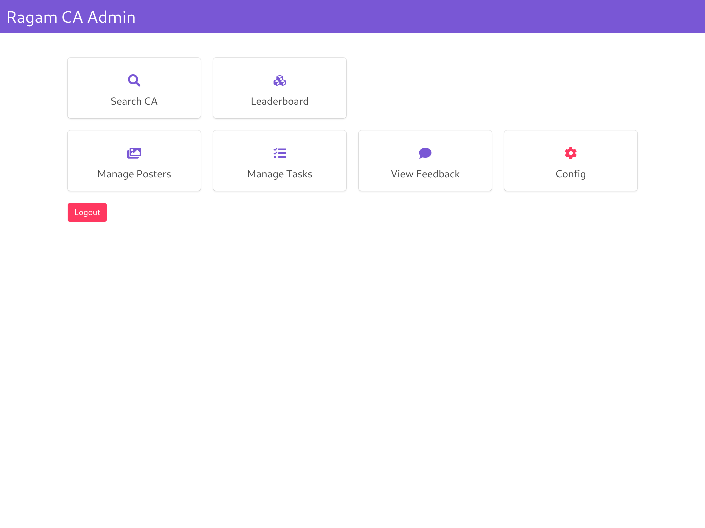
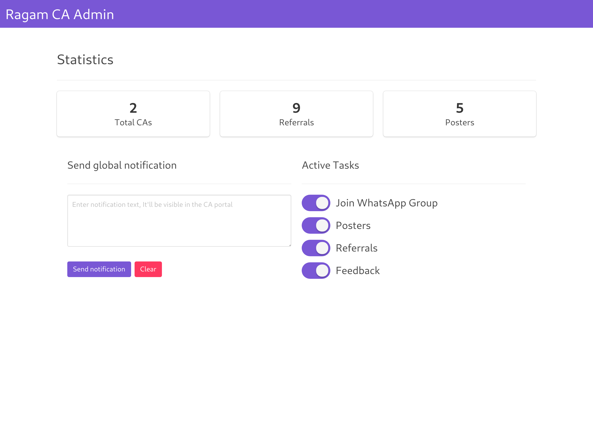
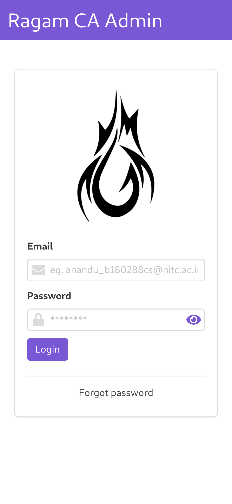
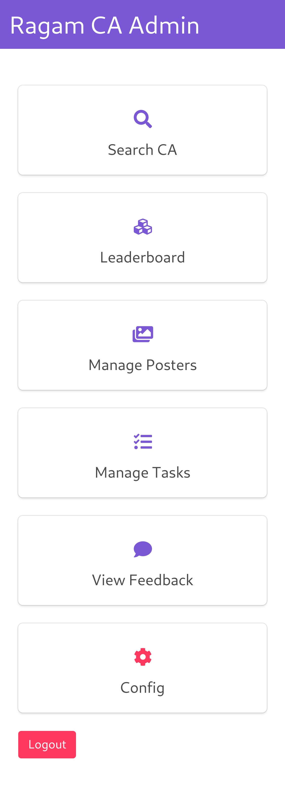
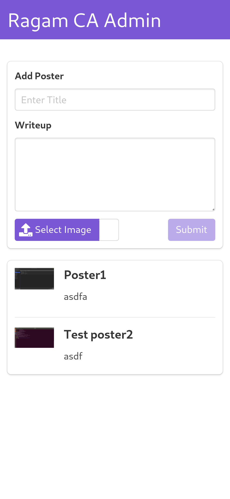
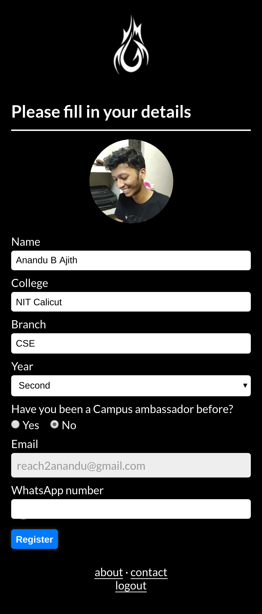
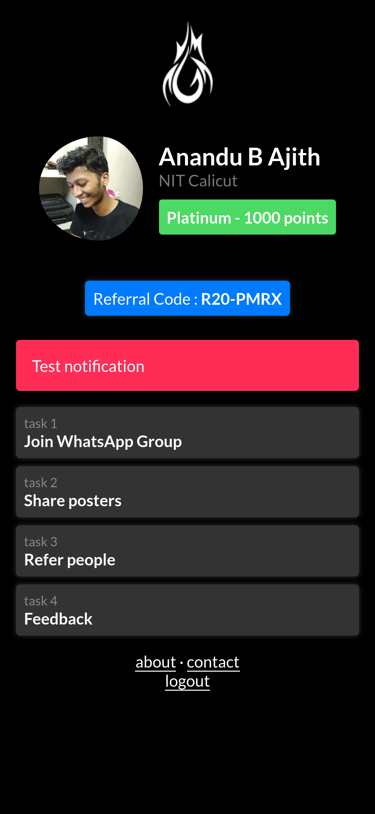

# Ragam'20

The repository contains four parts
- The main CA site (/ragam-ca)
- The Admin site (/ragam-admin)
- Firebase cloud functions (/functions)
- Helper functions to manage (/helpers)

## Built With

| | | |
|:-----:|:-----:|:-----:|
||||

## Screenshots
<details>
<summary>Admin</summary>

| | | |
|:-------------------------:|:-------------------------:|:-------------------------:|
| |  ||
| Admin Login Page Mobile  |  ||
</details>
<details>
<summary>CA Portal</summary>

| | | |
|:-------------------------:|:-------------------------:|:-------------------------:|
| |  ||
| | | |
</details>

## Deploying
<details> 
<summary> View Instructions </summary>
    
- Create a new Firebase project
    
- Setup and configure Firebase using `firebase-cli` as follows
    ```
    Hosting Ragam CA            => ragam-ca/dist
    Hosting Ragam Admin         => ragam-admin/dist
    Firebase Cloud functions    => functions
    ```
    (this should be pre configured with firebase.json)

- Update the Firebase config object in `ragam-admin/src/firebase.js` and `ragam-ca/src/main.js`

- Go to Firebase Project page and add Google , Email and Password as authentication providers.

- Create a new user with email and password note the UID ( This will be the admin user ).

- Update the new UID in `database.rules.json` and `storage.rules`.( This takes care of permissions )

- Seed the database with `database-seed.json` using Firebase console.

- Build and deploy using `yarn deploy`.

</details>
